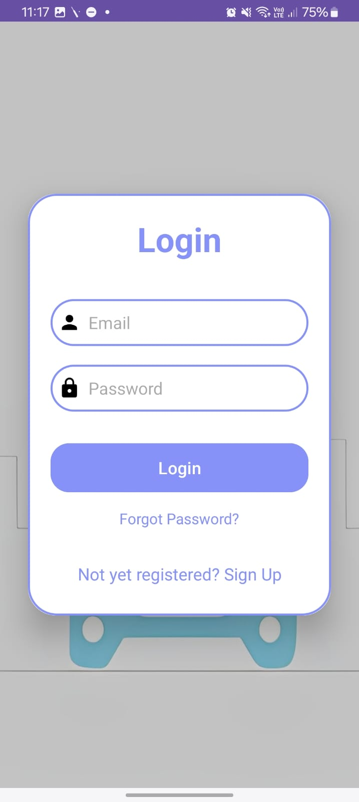
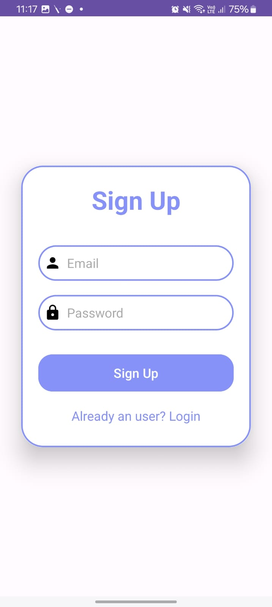
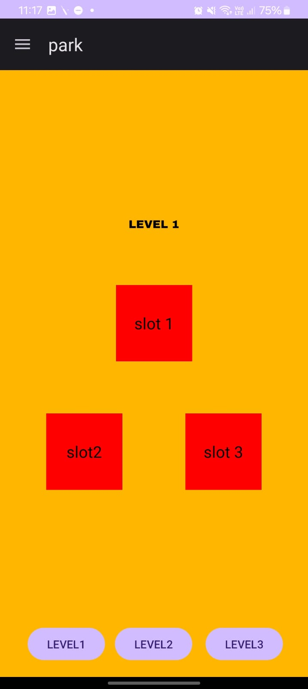
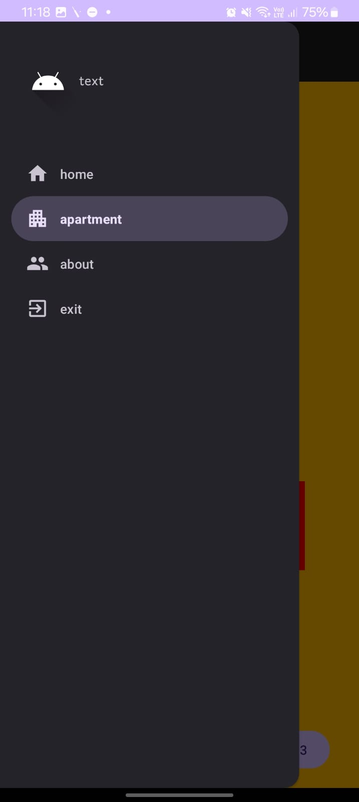

# 🚗 Park It Easy — Smart Parking System

**Park It Easy** is a smart IoT-based parking system designed to simplify the way users find and monitor real-time availability of parking slots using a mobile application. The system uses IR sensors, a NodeMCU Wi-Fi module, and Firebase to detect vehicle presence and display slot status inside a user-friendly Android app.

---

## 📦 System Overview

| Layer        | Components                                                                 |
|--------------|----------------------------------------------------------------------------|
| **Software** | Android App: Login/Signup, Home, Slot Availability, Exit                   |
| **Hardware** | IR Sensors, NodeMCU (ESP8266), LEDs (optional for visual indication)       |
| **Backend**  | Firebase Realtime Database + Firebase Authentication                       |

---

## ✅ Key Features

### 📱 Android Application (User Software)

- **Login/Signup**
  - User can securely register and sign in using email/password
  - Firebase Authentication is used for managing users

- **Home Page**
  - Welcome screen with navigation options:
    - View slot availability
    - Exit/logout

- **Slot Availability Page**
  - Visual display of parking slot statuses:
    - ✅ Green = Available
    - ❌ Red = Occupied
  - Realtime data fetched from Firebase database (live updates from hardware)

- **Exit Page**
  - Logs out the user and returns to the login screen

---

## 🔌 Hardware Components

| Component       | Description                                                                                |
|---------------- |----------------------------------------------------------------------------                |
| **IR Sensors**  | Detect whether a vehicle is present in a parking slot                                      |
| **NodeMCU**     | Wi-Fi-enabled microcontroller (ESP8266) that reads IR sensor data and sends it to Firebase |
| **LEDs**        | (Optional) Show physical slot status — Red for occupied, Green for free                    |
| **Power Supply**| To run NodeMCU and sensors                                                                |

**Function**:  
Each slot has an IR sensor. When a car enters or exits, the NodeMCU sends the updated slot status to Firebase in real-time.

---
## 📷Snapshots
### 🔐 Login Page


### 📝 Signup Page


### 🏠 Home Page


### 🚘 Slot Availability Page


### 🚪 Exit Page


## ☁️ Firebase Backend

| Feature                | Purpose                                        |
|------------------------|-----------------------------------------------|
| **Realtime Database**  | Stores live slot statuses (occupied/free)      |
| **Authentication**     | Manages user login and signup credentials      |

 ## 🔁System Architecture
[IR Sensor]
    ↓
[NodeMCU (ESP8266)]
    ↓
[Firebase Realtime Database]
    ↓                    ↑
[Android App] ←→ [Firebase Authentication]


**Structure Example (in Firebase Realtime Database):**
```json
{
  "sensor_data": "ON",
  "sensor_data2": "ON",
  "sensor_data3": "OFF",
  "sensor_data4": "OFF",
  "sensor_data5": "OFF",
  "sensor_data6": "OFF"
}
